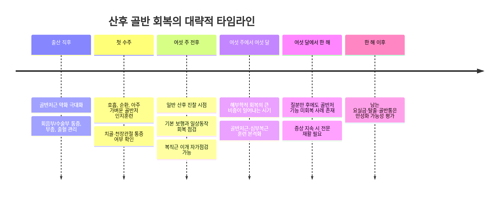

> **출처/제공 메모**
> 이 문서는 사용자가 **ChatGPT(GPT)에게 작성을 의뢰한 심층 보고서**를 원본 그대로 보존한 것입니다.
> 본문 중 `citeturn…` 형태의 토큰은 GPT가 생성한 **내부 인용 표시 아티팩트**로, 실제 클릭 가능한 링크가 아닙니다(원본 보존을 위해 그대로 둡니다).
> 전자책 콘텐츠(`content/`)의 근거 자료 중 하나이며, 다른 보고서와 **교차 검증** 대상입니다. 교차검증 요약은 README 참조.

---

# 산후 여성의 골반 교정 운동 심층 보고서

## Executive Summary

- 이 보고서에서 말하는 **"골반 교정 운동"은 뼈를 억지로 밀어 넣는 운동이 아니라**, 임신·출산으로 늘어나거나 약해진 **골반저근, 복부 깊은 근육, 호흡, 고관절·엉덩이 근육의 협응을 다시 회복하는 재활**을 뜻합니다. 임신과 출산 후의 문제는 실제로 골반저근 약화, 경결합 조직 손상, 관절 주위 안정성 저하, 복압 조절 실패가 섞여 나타나는 경우가 많습니다.
- **회복은 빠르면 수주, 흔히 수개월, 일부는 1년 이상** 걸립니다. 구조별로 다르며, **대부분의 해부학적 회복은 산후 첫 6개월에 가장 많이 일어나지만**, 질분만 후 골반저근 기능은 **12개월에도 임신 중 기준으로 완전히 돌아오지 않을 수 있습니다.**
- 산후 골반 재활이 중요한 이유는 **요실금, 골반장기탈출, 골반통, 허리·고관절 부담, 성기능 문제**와 연결되기 때문입니다. 다만 근거는 항목별로 차이가 있어, **요실금 예방·관리 근거는 비교적 강한 편**이고, **성기능·항문실금·탈출 증상 강도 개선 근거는 제한적이거나 일관되지 않습니다.**
- **운동 시작 시점은 분만 방식과 손상 정도에 따라 달라집니다.** 국내 공식 산후운동 자료는 보통 **자연분만 3일 이후, 제왕절개 1주 이후의 가벼운 체조**를 권하지만, 최근 골반건강 지침은 **통증·출혈·도뇨관·상처 상태를 보면서 더 이른 시기부터 호흡·걷기·아주 가벼운 골반저근 인지훈련**을 허용합니다.
- **증상이 있으면 "참고 지나가면 된다"는 접근이 가장 위험합니다.** 특히 **소변/대변 누출, 질 안의 묵직함·불룩함, 보행이 힘든 치골 통증, 회음부 상처 악화, 성교통, 8주 이후 뚜렷한 복직근 이개**는 전문의 또는 골반건강 물리치료 평가 기준에 해당합니다.

본 보고서는 **분만 방식, 산후 경과 기간, 회음부 열상 여부, 현재 증상 강도 등이 미지정**이라고 가정하고 작성했습니다. 따라서 각 권장은 **질분만과 제왕절개, 열상/봉합 여부, 다산, 고령 산모**에 따라 따로 수정해 제시합니다.
**이 보고서의 전반적 신뢰도: 86%**

## 골반이 어떻게 변하고 왜 달라지는가

산후에 많은 사람이 "골반이 벌어졌다"고 표현하지만, 의학적으로는 보통 **골반뼈 자체가 크게 벌어진 상태**만을 뜻하지 않습니다. 실제로는 **골반저근, 인대와 근막, 치골결합과 천장관절 주변 안정성, 복압 조절 시스템, 복직근과 복횡근 협응**이 함께 변한 결과를 말하는 경우가 훨씬 많습니다. NICE는 골반기능장애를 **방광·항문·질 주변의 골반저근이 제대로 작동하지 않는 상태**로 설명하며, 증상 범주에 **요실금, 변실금, 골반장기탈출, 성기능 문제, 만성 골반통**까지 포함합니다.

해부학적으로 골반저근은 **방광, 장, 자궁을 받쳐주는 "해먹" 같은 근육층**입니다. 출산 직후 이 근육은 일시적으로 매우 약해질 수 있고, RCOG도 **출산 직후에는 골반저가 강하지 않다**고 명시합니다. 또한 이 근육층은 단지 장기 지지뿐 아니라 **배뇨·배변 조절, 성기능, 허리·고관절 안정성**에도 관여합니다.

왜 이런 변화가 생길까요. 첫째는 **호르몬과 결합조직 변화**입니다. 임신 중 분비되는 relaxin, progesterone 등의 영향으로 골반 주변 인대와 연부조직은 더 유연해집니다. 다만 이것을 "통증의 단일 원인"으로 설명하는 것은 단순화입니다. 최근 골반통 환자 교육자료는 **과거처럼 relaxin만으로 골반통을 설명하지 않는다**고 정리하고 있고, 공식 자료들도 호르몬 영향은 인정하지만 개인차와 기전의 복잡성을 강조합니다. 따라서 **"호르몬 때문에 무조건 골반이 불안정해진다"는 말은 과장일 수 있으며, 추정일 수 있음**이라고 보는 편이 정확합니다.

둘째는 **기계적 스트레칭과 분만 손상**입니다. AJOG 전문가 리뷰에 따르면 질분만, 특히 아기 머리가 만출되는 시점에는 **levator ani와 산도 조직이 원래 길이의 3배 이상** 늘어나야 합니다. 이 과정에서 일부 여성은 **levator ani avulsion** 같은 근육 부착부 손상을 겪고, 이는 이후 골반장기탈출과 연관될 수 있습니다. 체계적 검토에서는 첫 질분만 후 **levator ani avulsion의 풀드 비율이 약 15%**로 추정되며, 문헌에 따라 더 넓은 범위가 보고됩니다.

셋째는 **골반 관절 변화**입니다. 치골결합(pubis symphysis)은 임신 전 보통 약 4–5 mm 정도 간격을 가지며, 임신 말기에는 **생리적으로 2–3 mm 정도 더 넓어질 수 있고**, 일부 자료에서는 **만기 약 7 mm 수준**까지 설명합니다. 그러나 **1 cm를 넘는 분리는 병적**으로 보고, 걷기 어려운 전방 골반통·불안정성을 만들 수 있습니다. 이런 경우는 흔한 일반적 "산후 골반 벌어짐"과는 별개의 진단 문제입니다.

넷째는 **복부-골반-횡격막 협응의 붕괴**입니다. 복직근 이개(DRA)는 임신 중 흔하며 NHS는 대개 **산후 8주경까지는 정상화되는 방향**이라고 설명하지만, 남아 있는 경우 허리 부담과 복압 조절 문제를 유발할 수 있어 심부 복부근 훈련이 중요합니다. 즉 산후 재활은 골반저근만의 문제가 아니라 **횡격막–복횡근–골반저근–고관절**이 함께 다시 일하도록 만드는 과정입니다.

## 회복의 시간표

회복 시기는 구조마다 다르고, 연구마다 측정법도 다르기 때문에 **정확한 "정답 시점"은 없습니다.** 아래 시간표는 임상 가이드라인과 최근 연구를 종합한 **범위 중심** 정리입니다. 특히 **호르몬성 이완, 인대 탄성 회복, 개인별 기능 회복**은 변동이 커서 일부 구간은 **추정일 수 있음**을 전제로 보셔야 합니다.

출산 직후에는 RCOG가 설명하듯 **골반저근 감각이 매우 약하거나 거의 안 느껴질 수 있으며**, 시간이 지나면서 운동 반복에 따라 감각이 돌아오는 경우가 많습니다. 이 시기 목표는 "강한 운동"이 아니라 **순환 개선, 부종·통증 관리, 호흡 회복, 골반저의 감각 되찾기**입니다.

구조적 회복에 대해서는 가장 자주 인용되는 종단 연구에서 **levator hiatus와 bladder neck mobility의 대부분 회복이 산후 첫 6개월에 일어났고**, 12개월에는 임신 중 변화의 상당 부분이 소실되었지만 **모든 여성이 임신 전/중 수준으로 완전히 돌아온 것은 아니었습니다.**

기능 회복은 더 느릴 수 있습니다. 2022년 전향 코호트 연구에서는 **질분만 후 12개월에도 골반저근의 resting pressure와 strength가 중기 임신 값보다 낮았고**, 특히 **긴 2기, 높은 BMI, 주요 levator ani tear**가 회복을 방해하는 요인으로 나타났습니다. 반면 제왕절개군은 같은 연구에서 상대적으로 보호 효과가 있었습니다. 이는 **"6주만 지나면 끝"이 아니라, 실제 기능 회복은 6–12개월도 흔하다**는 뜻입니다.

복직근 이개는 NHS 기준으로 **대개 8주 전후에 줄어드는 방향**이며, 그 시점에도 갭이 뚜렷하거나 복부 통증·불편감이 있으면 의사 또는 물리치료 상담을 권합니다. 최근 한국 연구에서는 **산후 한국 여성 대상 8주 모바일 기반 복부운동 프로그램이 초음파상 inter-recti distance를 유의하게 감소**시켰습니다.

골반띠 통증(PGP)은 대체로 출산 후 첫 수개월 내 좋아지지만 예외가 있습니다. 2026년 3년 추적 연구는 **대부분의 여성이 산후 4개월까지 기능을 회복**했다고 보고했고, 공식 환자자료는 **약 10% 정도는 통증이 지속될 수 있다**고 설명합니다. 따라서 **산후 3–4개월이 지나도 걷기·한발서기·침대에서 돌아눕기 등이 계속 힘들면 "조금 더 기다리면 낫겠지"보다는 평가가 필요**합니다.

치골결합의 **병적 분리**는 드물지만 중요합니다. 심한 앞쪽 골반통, 오리걸음, 침대에서 다리 벌리기가 극도로 힘든 경우에는 단순 근육 약화가 아니라 **치골결합 분리** 가능성을 고려해야 하며, 일부는 수주~수개월 보존치료로 호전되지만 심한 분리는 수술이 필요할 수 있습니다.

## 왜 운동이 중요한가

가장 분명한 이유는 **요실금과 골반장기탈출**입니다. 산후 첫 1년 사이 요실금은 매우 흔하며, 체계적 문헌고찰은 **6주~1년 산후의 요실금 유병률 가중평균을 약 31%**로 제시합니다. 국내 대한산부인과학회 학술지의 2024년 연구도 한국 여성에서 임신 중 요실금 부담이 상당하다고 보고해, 임신·산후를 연속선으로 보는 관리가 필요함을 보여줍니다.

운동의 근거는 항목별로 다릅니다. 2025년 BJSM 체계적 문헌고찰·메타분석은 **산후 1년 내 운동**, 특히 **골반저근운동(PFMT)** 이 **산후 요실금 odds를 낮추고**, 골반장기탈출과 복직근 이개에도 이점이 있을 수 있다고 정리했습니다. 같은 리뷰는 **성기능, 항문실금, 증상 심각도**에 대한 근거는 제한적이라고 밝혔습니다. 즉, **"산후 골반 운동은 확실히 좋다"는 말은 요실금 예방·관리에는 비교적 맞지만**, 모든 골반 증상에 같은 강도로 적용되지는 않습니다.

중요한 점은 **근거가 완전히 일관되지는 않더라도, 임상 지침은 PFMT를 여전히 1차 보존치료로 권고**한다는 것입니다. NICE는 모든 여성, 특히 **임신 중이거나 최근 출산한 여성에게 PFMT를 권장**하고, 특정 분만 위험요인이 있었다면 **3개월 supervised PFMT** 를 고려하라고 권합니다. 반면 Cochrane 2020 요약은 **이미 증상이 지속된 산후 여성만 따로 보면 6–12개월 이후 장기효과가 불확실**하다고 정리했습니다. 이 차이는 "PFMT가 무의미하다"가 아니라, **대상군과 시작 시점, 훈련의 강도·순응도 차이로 결과가 흔들린다**는 뜻에 가깝습니다.

요추·고관절 측면에서도 의미가 있습니다. NHS와 산과 골반건강 자료는 골반저와 심부복부 훈련이 **허리 부담을 덜고 자세 회복**에 도움이 된다고 설명합니다. 산후 여성 대상 국내 물리치료 파일럿 연구도 **근골격·보행·체성분 회복을 목표로 한 구조화 프로그램의 필요성**을 보여줬습니다. 다만 이 영역은 PFMT만큼 근거가 강하지 않아, **대부분은 저부하 코어 재교육과 자세 교정 중심의 전문가 합의** 수준으로 보는 것이 정확합니다.

성기능은 더 신중하게 설명해야 합니다. NHS의 일반 자료는 골반저근 운동이 **성관계 시 기능 개선에 도움**이 될 수 있다고 소개하지만, 2022년 산후 초산모 RCT에서는 **감독하 PFMT가 대조군보다 성기능을 추가로 더 좋게 만들지는 못했고**, 두 군 모두 시간이 지나며 호전됐습니다. 따라서 **성기능 개선을 "보장"한다고 말하면 과장**입니다. 더 정확한 표현은 **통증·지지감·혈류·근조절 개선에 도움을 줄 수 있으나, 추가 효과는 개인차가 크다**입니다.

시기를 놓쳤을 때의 장기 위험도도 무시하기 어렵습니다. 2024년 AJOG 전문가 리뷰는 **levator ani 손상이 훗날 탈출과 강하게 연결**된다고 설명하며, 손상은 훗날 탈출 여성의 절반 이상에서 보인다고 정리했습니다. 또한 질분만은 제왕절개만 한 경우보다 **장기적 stress urinary incontinence와 prolapse 위험을 더 높이는 경향**이 여러 연구와 검토에서 반복됩니다. 2024년 업데이트된 체계적 문헌고찰도 **산후 SUI 위험 요인으로 질분만, 나이, BMI, 다산**을 제시했습니다.

특히 **회음부 3·4도 열상(OASI)** 는 별도로 봐야 합니다. RCOG는 출산 후 초기에는 골반저 감각이 적을 수 있지만, **대변 조절 문제나 방광·장 증상이 지속되면 물리치료 및 추가 치료가 필요**하다고 안내합니다. 이 집단은 단순 "셀프 운동"보다 **전문 재활 개입의 문턱이 낮아야 하는 고위험군**입니다.

## 시기와 상황에 따른 운동 처방

먼저 원칙부터 분명히 하겠습니다. **산후 운동은 "강하게 조이기"가 아니라 "잘 느끼고, 잘 조이고, 잘 푸는 것"**에서 시작해야 합니다. 특히 **통증, 질 안의 묵직함·불룩함, 출혈 증가, 상처 통증 증가, 소변이 잘 안 나옴**이 있으면 강도를 낮추거나 중단해야 합니다. NICE는 최근 출산 여성에게 PFMT를 권하지만, 동시에 **수축과 이완을 실제로 할 수 있는지 평가하고 이에 맞춰 훈련을 개별화**해야 한다고 명시합니다.

국내 공식 산후운동 자료는 **자연분만 3일 후, 제왕절개 1주 후**부터 상태에 맞는 간단한 운동을 권하고, 더 이른 시기에는 **걷기·호흡·회음부 수축 운동** 정도를 허용합니다. 반면 최신 골반건강 자료는 "상태가 허락하면 더 이르게, 그러나 더 가볍게"라는 방향입니다. 그래서 아래 표는 **보수적이면서도 최신 골반재활 원칙에 맞춘 실용 버전**으로 정리했습니다.

### 시기별 권장 운동 요약 표

| 시기 | 목표 | 권장 운동 | 방법·횟수 | 분만 방식·상황별 수정 | 피해야 할 것 | 근거 수준 |
|---|---|---|---|---|---|---|
| 즉시 산후 | 부종·통증 관리, 호흡 회복, 혈액순환, 골반저 인지 회복 | **횡격막 호흡**, 발목 펌프, 짧은 실내 보행, 아주 가벼운 골반저 "인지" 수축 | 호흡 5분, 하루 2–4회. 짧은 보행 여러 번. 골반저는 **통증 없이** 2–3초 가볍게 조였다 풀기 5–10회 | **제왕절개:** 기침·재채기 때 베개로 상처 지지, 복부 strain 최소화. **도뇨관 있으면 PFMT 보류**. **회음부 열상/OASI:** 통증 허용 범위에서만 시작 | 숨 참고 힘주기, 오래 서 있기, 과도한 복부 말아올리기 | 공식 가이드·환자교육, 중등도 이하 |
| 초기 회복기 | 골반저근 수축·이완 패턴 회복, 일상동작 안전화 | **기본 PFMT**, 옆으로 돌아 일어나기(log roll), 자세 재교육, 짧은 걷기 | PFMT는 누워서 시작. 수축 3–5초, 이완 3–5초, 5–10회. 하루 3세트 내외에서 점진 증가 | **질분만 후 회음부 불편:** 부드러운 쿠션 위 앉기 도움. **제왕절개:** 아기보다 무거운 들기·복부 strain은 첫 6주 특히 주의 | 윗몸일으키기, 무거운 짐 들기, 통증을 참고 하는 스쿼트/플랭크 | 공식 가이드·전문가 합의 |
| 회복기 | 골반저근 지구력·속도 회복, 심부복부 활성화 | **장수축+단수축 PFMT**, 코르셋식 하복부 당김, 골반틸트, 힙 브리지, sit-to-stand | 장수축: 5–10초 hold를 목표로 8–10회. 단수축: 빠르게 8–10회. 하루 3회. 브리지·틸트·sit-to-stand는 6–12회, 2–3세트 | **복직근 이개가 뚜렷하면:** 머리·몸통을 크게 말아올리는 복근운동보다 심부복부부터. **OASI/통증 우세:** 강도보다 조절 우선 | 배를 앞으로 밀어내는 힘주기, doming이 심한 curl-up, 질 묵직함이 생기는 운동 | PFMT는 높음, 심부복부·브리지는 중간~낮음 |
| 중기 | 코어-골반-고관절 협응, 기능적 힘 회복 | 브리지 진행형, clamshell/옆엉덩이 강화, 미니 스쿼트, 런지 기초, step-up, brisk walking, 고정식 자전거·수영 | 주 2–3회 근력, 주 3–5회 유산소. 모든 힘쓰기 동작은 **내쉬며** 수행 | **다산·30세 이상·기구분만·장시간 2기:** supervised PFMT 우선 권장. 증상 있으면 고충격 금지 | 통증/누출/하강감이 생기는 jump, run, heavy lift | PFMT는 높음, 기능적 근력은 전문가 합의+파일럿 |
| 장기 | 고충격 복귀 여부 판단, 재발 예방 | 조깅 전 준비운동, 가벼운 제자리 조깅, hop, single-leg control, 유지용 PFMT 1세트/일 | **최소 12주 이후**, 그리고 증상 없을 때만. 증상 없으면 PFMT 유지 1세트/일, 근력 주 2회 | **누출·질압박감·통증 있으면 고충격 보류**. **제왕절개라도 예외 아님** | 12주 이전의 러닝·점프, 질 출혈 재증가 상태에서의 고충격 | 고충격 복귀는 전문가 합의, 유지 PFMT는 가이드라인 |

### 상황별 수정 원칙

| 상황 | 권장 수정 | 늦춰야 할 것 | 상담 기준 |
|---|---|---|---|
| **자연분만 후 통증이 크지 않은 경우** | 호흡·걷기·기본 PFMT를 비교적 일찍 시작 가능 | 복부 말아올리기, 점프, 러닝 | 6–12주 지나도 누출·하강감 지속 시 상담 |
| **회음절개 또는 2도 열상** | 통증 없는 범위에서 PFMT. 누워서/쿠션 위 앉아 시작 | 강한 벌림 스트레칭, 상처 당기는 동작 | 냄새, 출혈 증가, 통증 악화 시 진료 |
| **3·4도 열상 OASI** | 골반저 운동은 가능한 일찍 시작하되 반드시 통증 범위 내. 전문 재활 문턱 낮게 | 고충격, 무거운 들기, 과도한 복압 운동 | 대변·방귀 조절 문제, 감각 회복 지연, 상처 문제 시 즉시 상담 |
| **제왕절개** | 호흡, 보행, PFMT는 가능하되 상처 지지와 strain 최소화. 상처 회복 전에는 부하보다 조절 우선 | 첫 6주간 복부 강한 strain, 무거운 들기 | 상처 발적·열감·벌어짐·기침 시 심한 통증 시 진료 |
| **다산, 30세 이상, 기구분만, 장시간 2기** | supervised PFMT와 더 느린 진행을 우선 고려 | 증상 있는데도 자가 고충격 운동 | 증상이 없더라도 3개월 supervised PFMT 고려 가능 |
| **통증 우세형 골반저 문제** | 강한 케겔보다 **이완 호흡, 긴장 완화, 통증 없는 범위 ROM**부터 | "더 세게 조이는" 반복 훈련 | 성교통, 배변곤란, 배뇨 불편, 꼬리뼈 통증이 지속되면 상담 |

### 운동별 핵심 설명

**골반저근운동(PFMT, 케겔)**은 가장 우선순위가 높습니다. 방법은 "방귀와 소변을 동시에 참는 느낌"으로 **안쪽으로 당기고 위로 끌어올리는 수축**을 만드는 것입니다. NHS 자료는 **장수축과 단수축을 모두 포함해 하루 3회, 각 10회까지 점진 증가**를 권하며, NICE는 **수축뿐 아니라 이완 능력도 평가하고 개별화**해야 한다고 강조합니다. 근거 수준은 **높음**입니다.

**횡격막 호흡과 하복부 코르셋식 활성화**는 직접적인 대규모 RCT 근거는 PFMT보다 약하지만, **복압을 아래로 밀어내지 않고 골반저와 복횡근을 다시 연결**하는 데 중요합니다. NHS는 숨을 내쉬며 **하복부를 부드럽게 당기고 골반저를 같이 수축**하는 기초 복부운동을 제시합니다. 근거 수준은 **중간 이하**지만 실제 임상 적용도는 높습니다.

**브리지, 골반틸트, sit-to-stand, clamshell** 같은 저부하 근력운동은 엉덩이와 몸통 협응 회복에 유익합니다. 다만 이 운동들은 **복압이 올라가도 버티는지**가 더 중요하므로, 운동 중 배가 앞으로 솟거나 질 안이 눌리는 느낌이 들면 강도를 낮춰야 합니다. 이들은 주로 **전문가 합의와 파일럿 연구** 수준 근거입니다.

**고충격 운동 복귀**는 가장 많이 서두르는 부분인데, 과학적으로는 여기서 가장 신중해야 합니다. 여러 골반건강 물리치료 지침과 합의문은 **러닝·점프는 산후 12주 이전에 권하지 않으며**, 시작 전 **증상 없음 + 기능 체크 통과**를 요구합니다. 근거 수준은 **전문가 합의**가 주축입니다.

## 집에서 확인하는 셀프 스크리닝

아래 평가는 **자가 선별(screening)** 입니다. **진단**이 아닙니다. 한 가지라도 이상하면 실패라고 보라는 뜻이 아니라, **"이쯤이면 집운동만으로는 부족할 수 있다"는 신호**로 보시면 됩니다.

### 셀프 테스트 단계별 표

| 테스트 | 언제 | 방법 | 이렇게 해석 | 상담이 필요한 경우 |
|---|---|---|---|---|
| **증상 체크리스트** | 언제든 | 아래 증상이 있는지 확인: 소변 누출, 급박뇨, 질 안 무거움/불룩함, 배변 조절 문제, 성교통, 골반·치골 통증 | 증상이 전혀 없으면 일반 프로그램 지속 가능성이 높음 | 하나라도 **지속**되거나, 운동·기침·들기 때 악화되면 상담 |
| **골반저 수축·이완 감각 테스트** | 도뇨관 제거 후, 통증 허용 시 | 누워서 숨을 내쉬며 "방귀와 소변을 참는 느낌"으로 2–3초 가볍게 조였다 풀기. 배·엉덩이·허벅지에 과하게 힘이 들어가면 다시 | 안쪽으로 살짝 "들리는 느낌"이 나고, 끝나면 완전히 풀리면 좋음 | 2–4주가 지나도 감각이 거의 없거나, 오히려 아래로 밀어내는 느낌, 통증, 긴장만 심하면 상담 |
| **복직근 이개 finger-width 테스트** | 보통 6–8주 이후 | 누워서 무릎 세우고, 어깨를 살짝 들어 올린 뒤 배꼽 위·아래 중앙의 갭을 손가락으로 확인 | 시간이 갈수록 갭이 줄면 회복 방향 | **8주 이후에도 갭이 뚜렷**하거나 통증·불편이 있으면 GP/물리치료 상담 |
| **일상 기능 테스트** | 6–12주 이후 | 20–30분 걷기, 침대에서 옆으로 돌아 일어나기, 아기 들고 앉았다 일어나기 때 통증/누출/하강감 확인 | 증상 없이 가능하면 중간 단계로 진행 가능 | 걸을수록 질 묵직함, 앞골반 통증, 누출이 생기면 상담 |
| **고충격 준비도 테스트** | 12주 이후 | 30분 걷기, 한발서기 10초, 한발 스쿼트 10회, 제자리 조깅 1분, 홉 10회/측을 **통증·하강감·누출 없이** 수행 가능한지 확인 | 모두 무증상으로 되면 러닝·점프를 단계적으로 시도할 여지가 있음 | 하나라도 증상을 유발하면 아직 고충격 시기 아님. PT 상담 권장 |

추가로 중요한 점이 하나 있습니다. **화장실에서 소변을 일부러 끊어보며 운동하는 습관은 권장되지 않습니다.** NHS도 화장실은 **운동을 떠올리는 "알림" 정도**로만 쓰고, 실제 운동은 **배뇨를 마친 뒤** 하라고 안내합니다.

그리고 **"조이는 느낌"만 있고 "푸는 느낌"이 안 되면** 그 또한 문제일 수 있습니다. 일부 여성은 산후에 과긴장형 골반저 문제를 같이 가지며, 이런 경우에는 강한 케겔보다 **이완 훈련과 통증 조절**이 더 먼저일 수 있습니다.

## 안전수칙과 생활 팁

운동 시작 시점은 날짜보다 **몸의 조건**이 더 중요합니다. 기본적으로는 **출혈이 줄어드는 추세이고, 감염 의심이 없고, 통증이 조절 가능하며, 짧게라도 집 안 보행이 가능하고, PFMT는 도뇨관 제거 후** 시작하는 것이 안전합니다. 국내 공식 자료도 **자연분만은 3일 이후, 제왕절개는 1주 이후부터 무리 없는 선에서 시작**하라고 하고, NHS 산후 안내는 첫 6주간 **복부 strain과 무거운 들기를 특별히 조심**하라고 합니다.

운동을 **즉시 중단하고 의료 평가가 필요한 신호**도 분명합니다. 대표적으로 **갑자기 많아지는 출혈, 악취가 나는 분비물, 발열·오한·복통, 한쪽 종아리 통증/붓기, 갑작스러운 흉통이나 호흡곤란, 상처 통증의 급격한 증가** 입니다. 회음부 상처가 있는 경우 **냄새, 출혈, 통증 증가**도 감염 경고 신호입니다.

일상 팁은 생각보다 효과가 큽니다.
수유할 때는 **허리를 곧게 세우고, 허리 뒤에 쿠션을 받치고, 발이 바닥에 닿도록** 하는 자세가 허리 부담을 줄입니다. 바닥의 물건을 집을 때는 허리를 굽히기보다 **무릎을 굽혀 앉거나 쪼그려** 가는 편이 낫습니다. 아기를 안거나 유모차를 밀 때도 **등을 길게 세우는 자세**가 좋습니다.

침대에서 일어날 때는 바로 윗몸을 말아올리기보다 **옆으로 돌아서 팔로 밀고 일어나는 log-roll** 방식이 복부와 골반저 부담을 줄입니다. 제왕절개 후에는 기침·재채기 때 **베개나 수건으로 상처를 지지**하는 것이 도움이 됩니다.

배변 습관도 중요합니다. NICE와 질병관리청 자료는 **변비가 골반기능장애의 조절 가능한 위험요인**이라고 보고, **섬유질, 적절한 수분, 규칙적 운동**을 권합니다. 변비가 심하면 골반저는 매번 "mini lifting"을 하는 대신 매번 "과도한 버티기"를 하게 되어 회복이 느려집니다.

체중 관리 역시 중요합니다. NICE는 **BMI 25 이상**을 골반기능장애 위험요인으로 제시하고, 2024년 체계적 검토 역시 **BMI와 산후 SUI 위험 증가**를 보고했습니다. 따라서 산후 체중 관리는 미용이 아니라 **골반 하중 관리**로 이해하는 것이 맞습니다.

마지막으로, **"증상이 있으면 운동을 안 해야 한다"가 아니라, "증상 유형에 맞는 운동을 해야 한다"**가 핵심입니다. 누출과 지지감 저하가 주증상이면 PFMT 중심으로 가고, 통증·긴장·배변곤란·성교통이 주증상이면 이완과 통증조절을 앞세워야 합니다. 이 구분을 스스로 하기 어렵다면 그 지점이 바로 골반건강 물리치료 평가 시점입니다.

## 우선 참조 출처와 공식 자료

### 공식 다이어그램·시연 자료

- **임신육아종합포털 아이사랑 산전·산후 체조 자료** — 국내 공식 산후체조 안내, 시작 시기와 예시 동작 포함.
- **RCOG OASI 환자자료의 골반저근 측면 해부도** — 골반저가 방광·자궁·직장을 어떻게 지지하는지 직관적으로 이해하기 좋습니다.
- **NHS Your post-pregnancy body** — 골반저근 운동법과 복직근 이개 자가점검 절차가 간단명료하게 정리돼 있습니다.
- **Gloucestershire NHS Pelvic floor health videos** — 골반저 운동, 허리·골반 통증, 앱 안내 영상 모음.
- **Black Country NHS Perinatal Pelvic Health Service** — 골반저 운동, 산후 제왕절개 회복, 상처 관리, 복부근육, 운동 복귀 영상 링크를 한 곳에 모아 둔 자료.

### 우선 참조 출처 목록

아래 목록은 **국내 공식·국내 학술 출처를 우선 배치**하고, 그 다음으로 **국제 가이드라인·체계적 문헌고찰·핵심 코호트/RCT** 를 배치했습니다.

- **임신육아종합포털 아이사랑 – 산후 운동관리**: 국내 공식 산후운동 자료, 대한산부인과학회 정보위원회 감수.
- **질병관리청 국가건강정보포털 – 요실금**: 골반근육운동, 생활습관, 위험요인 정리.
- **Jung H, et al. Obstetrics & Gynecology Science 2024**: 한국 임신 여성 요실금 유병률과 위험요인. 대한산부인과학회 학술지.
- **Byeon N, et al. Physical Therapy Rehabilitation Science 2023**: 산후 회복 운동프로그램과 코어 안정화 프로그램 비교 파일럿 연구.
- **Chang AS, et al. 대한스포츠의학회지 2024**: 한국 산후 여성 대상 모바일 기반 복부운동 프로그램의 inter-recti distance 감소 효과.
- **NICE NG210 2021**: Pelvic floor dysfunction 예방·평가·비수술 관리 가이드라인. 산후 여성에 대한 정보 제공, 위험요인, supervised PFMT 3개월 권고 포함.
- **RCOG – Your pelvic floor / OASI patient information**: 산후 초기 골반저근 상태, 열상 후 회복, 언제 도움을 받아야 하는지에 대한 공식 안내.
- **NHS – Your post-pregnancy body**: 복직근 이개 자가점검, 골반저 운동, 허리 보호 자세.
- **Beamish NF, et al. BJSM 2025**: 산후 첫 1년 운동이 골반기능장애와 복직근 이개에 미치는 영향에 대한 체계적 문헌고찰·메타분석.
- **Stær-Jensen J, et al. 2015**: levator hiatus와 bladder neck mobility의 산후 회복 종단 연구. 대부분의 회복은 첫 6개월에 발생.
- **Bø K, et al. 2022**: 초산모 골반저근 strength/endurance의 6·12개월 산후 회복 코호트. 질분만 후 12개월에도 완전 회복 아님.
- **DeLancey JOL, et al. AJOG 2024**: 질분만 중 골반저 손상의 생역학과 장기 영향에 대한 전문가 리뷰.
- **Schütze S, et al. 2022**: 산후 초산모 300명 RCT, PFMT와 성기능·골반저 기능.
- **Sigurdardottir T, et al. 2023**: 산후 prolapse 증상과 PFMT에 대한 RCT 2차 분석. 단일 연구에서는 prolapse outcome 변화가 크지 않았음.
- **Woodley SJ, et al. Cochrane 2020**: 임신·산후 PFMT의 예방·치료 효과에 대한 핵심 종합근거.

### 불확실한 정보와 해석 주의점

- **호르몬 영향의 정확한 종료 시점**은 연구마다 다르고 개인차가 큽니다. relaxin 관련 공식 자료는 수개월 지속 가능성을 언급하지만, **골반통이나 불안정성을 relaxin 하나로 설명하는 것은 근거가 약합니다. 추정일 수 있음.**
- **"몇 주면 완전히 회복된다"는 단정**은 부정확합니다. 해부학적 지표는 산후 첫 6개월에 크게 회복되지만, 기능은 12개월에도 남을 수 있습니다.
- **브리지, clamshell, sit-to-stand 같은 중간 단계 운동**은 실무에서 매우 널리 쓰이지만, PFMT처럼 강한 RCT 근거가 있는 것은 아닙니다. 따라서 이들은 **증상 유발 여부를 보며 개별화**해야 합니다.
- **고충격 운동 복귀 체크리스트**는 엄밀한 진단도구가 아니라, 골반건강 물리치료 분야의 **전문가 합의 기반 기능 스크리닝**입니다.
