# 산후 골반·코어 재활 일러스트 갤러리

총 15종의 가로형 PNG입니다. 모든 이미지는 글자·로고·워터마크 없이 제작되어 한국어와 베트남어 페이지에서 공용으로 사용할 수 있습니다. 이미지 생성 결과에 따라 파일별 픽셀 크기는 조금씩 다르므로 웹에서는 원본 종횡비를 유지하십시오.

> 게시 전 여성건강 물리치료 전문가의 자세·해부학 검수를 권장합니다. 이미지는 동작을 이해시키는 보조 자료이며 진단이나 개인별 운동 처방이 아닙니다.

## IL-00a — 골반과 코어 구조

권장 대체 텍스트: 산후 여성의 몸통을 중심으로 횡격막, 복부, 골반저가 함께 작동하는 위치를 부드러운 색으로 보여 주는 교육 그림.

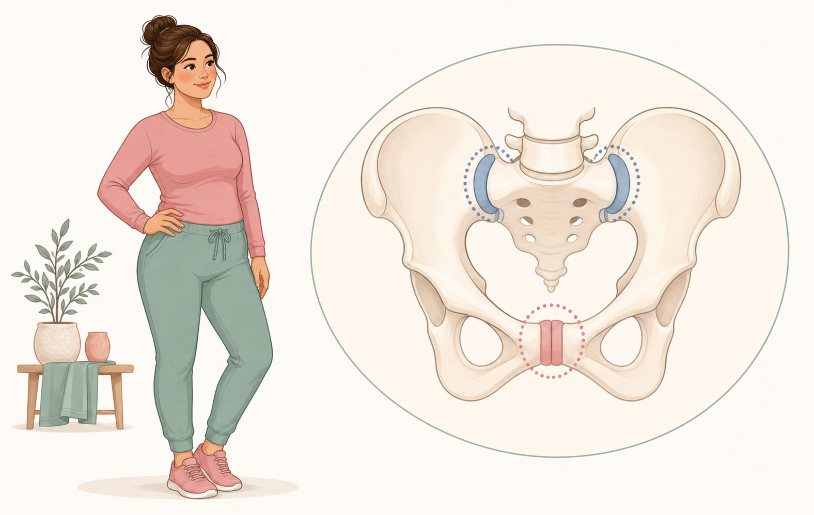

## IL-00b — 편안한 자세 정렬

권장 대체 텍스트: 젊은 산후 여성이 무리하게 몸을 세우지 않고 갈비뼈와 골반을 편안하게 정렬하는 모습을 비교한 그림.

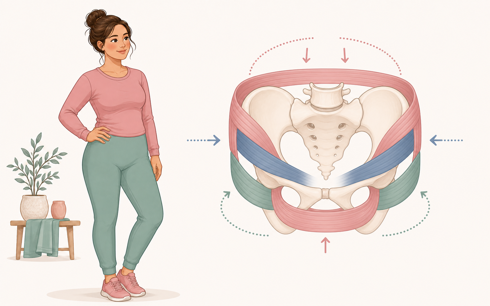

## IL-01a — 복직근 이개 자가 관찰

권장 대체 텍스트: 무릎을 세우고 누운 여성이 배 중앙의 간격과 장력을 손가락으로 부드럽게 살펴보는 단계별 그림.

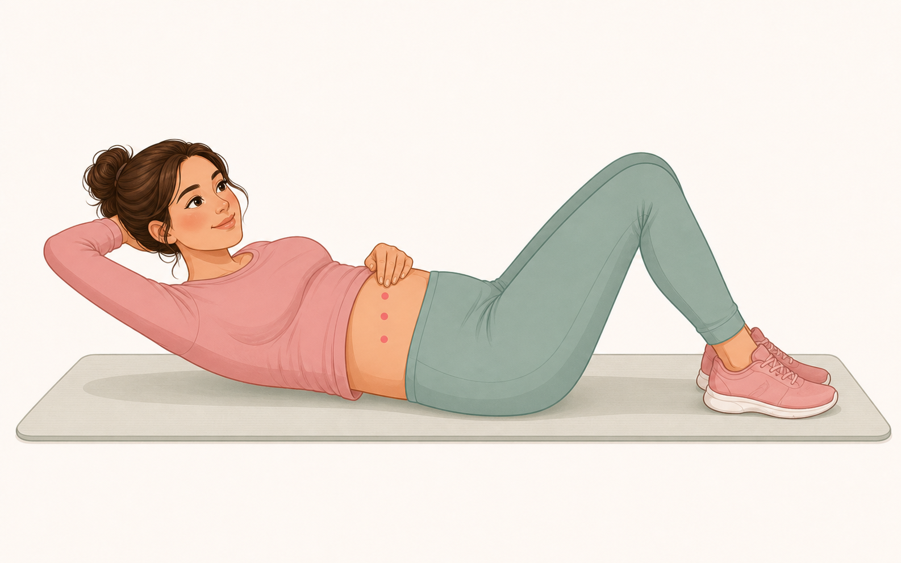

## IL-01b — 낮은 다리 들기와 서기 관찰

권장 대체 텍스트: 누워서 한쪽 다리를 조금만 들어 몸통 반응을 살피는 모습과 의자를 잡고 편안하게 서서 균형을 확인하는 모습.

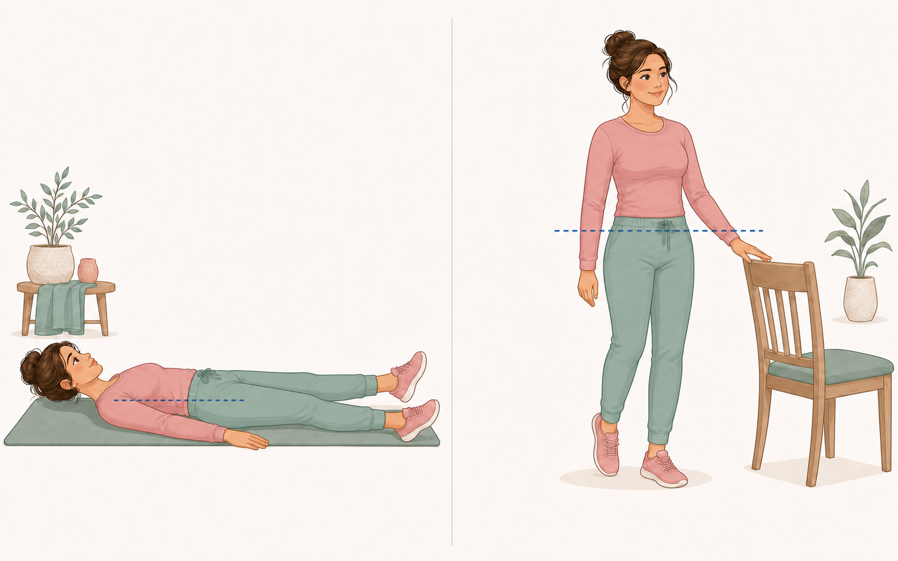

## IL-01c — 일상 증상 확인

권장 대체 텍스트: 산후 여성이 걷기와 집안 동작 중 통증, 압박감, 출혈 증가 같은 몸의 신호를 차분히 확인하는 그림.

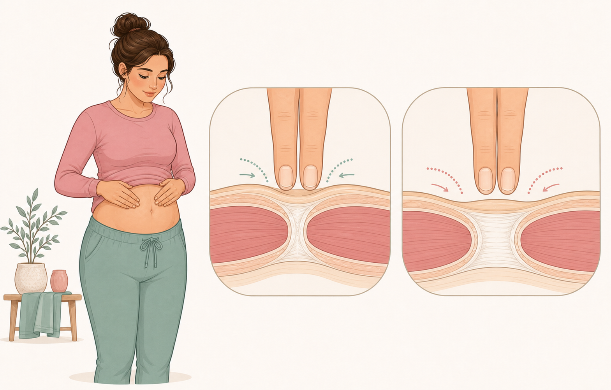

## IL-02a — 편안한 횡격막 호흡

권장 대체 텍스트: 무릎을 세우고 누운 여성이 한 손을 갈비뼈와 배에 두고 편안하게 들이쉬고 내쉬는 모습을 단계별로 보여 주는 그림.

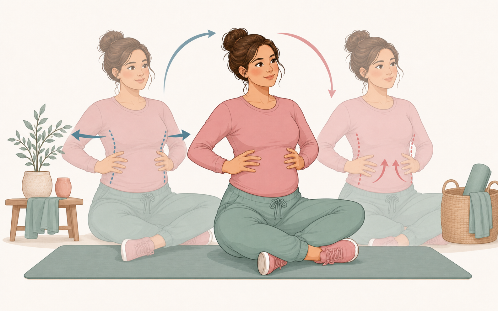

## IL-02b — 골반저 수축과 완전 이완

권장 대체 텍스트: 산후 여성이 숨을 참지 않은 채 골반저를 부드럽게 수축한 뒤 충분히 이완하는 두 단계를 상징적으로 보여 주는 그림.

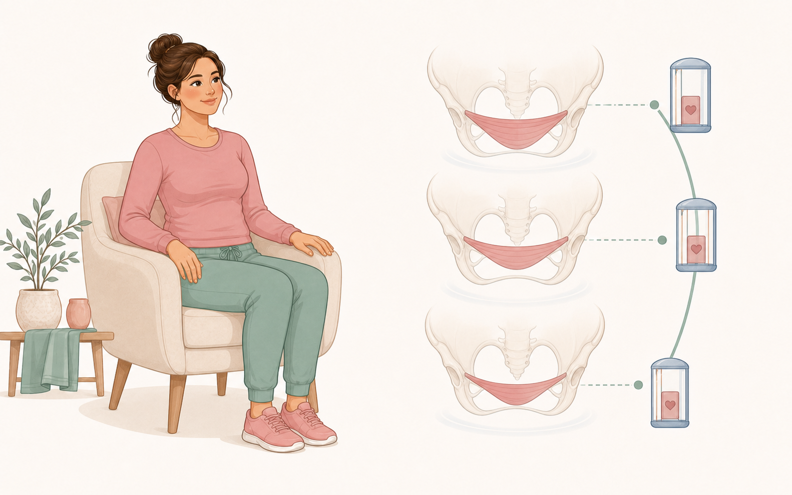

## IL-02c — 힐 슬라이드

권장 대체 텍스트: 무릎을 세우고 누운 여성이 한쪽 발뒤꿈치를 바닥에서 천천히 멀리 미끄러뜨렸다가 돌아오는 동작.

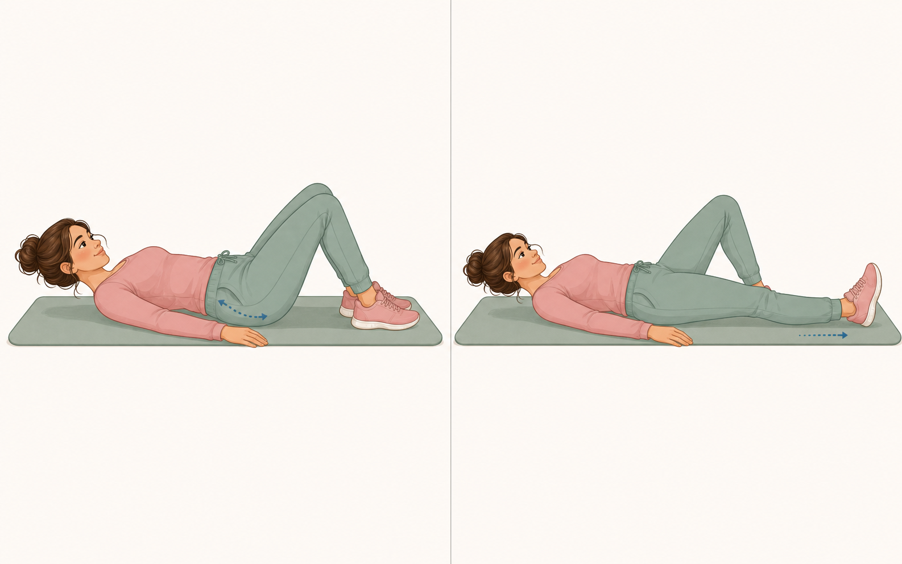

## IL-02d — 글루트 브리지

권장 대체 텍스트: 발을 바닥에 둔 산후 여성이 통증 없는 범위에서 골반을 천천히 들어 올리는 브리지 동작의 시작과 끝.

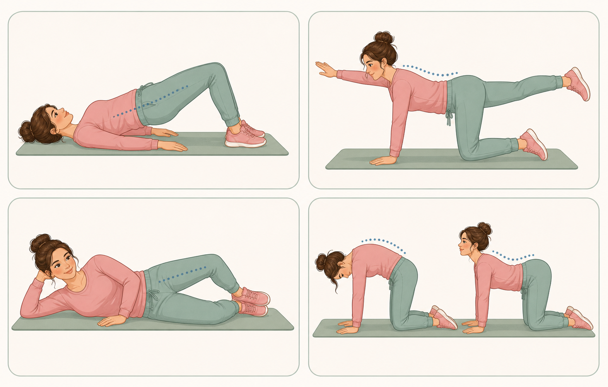

## IL-02e — 복부 중앙 도밍 비교

권장 대체 텍스트: 같은 동작에서 배가 편안하고 고른 경우와 배 중앙에 좁은 능선 모양의 도밍이 생긴 경우를 나란히 비교한 그림.

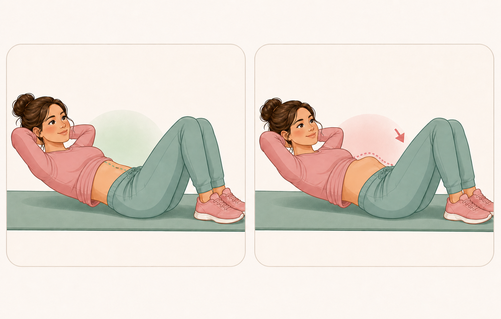

## IL-02f — 네발기기 코어 협응

권장 대체 텍스트: 네발기기 자세에서 척추를 편안하게 유지하며 호흡과 몸통의 안정감을 연습하는 산후 여성.

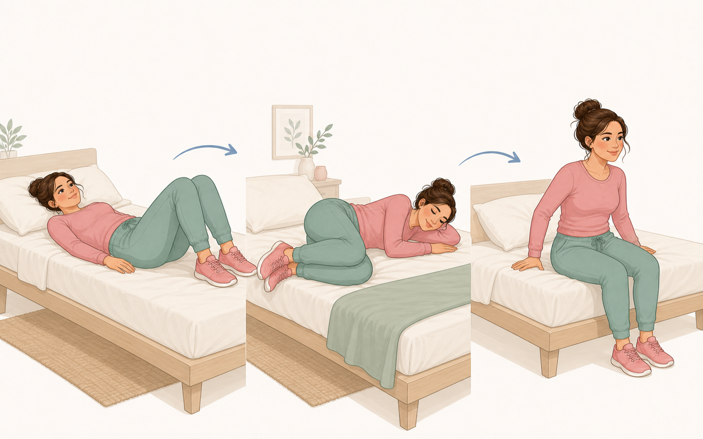

## IL-03a — 스쿼트와 힙 힌지

권장 대체 텍스트: 의자를 활용한 편안한 스쿼트와 엉덩이를 뒤로 보내 물건을 드는 힙 힌지를 나란히 보여 주는 그림.

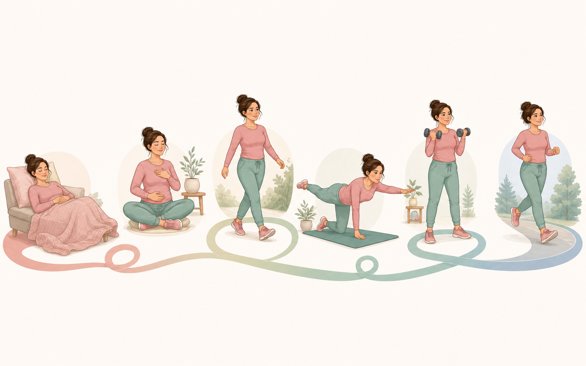

## IL-03b — 물건 들기와 계단

권장 대체 텍스트: 산후 여성이 물건을 몸 가까이 들고 이동하는 모습과 난간을 잡고 계단을 오르는 모습을 보여 주는 그림.

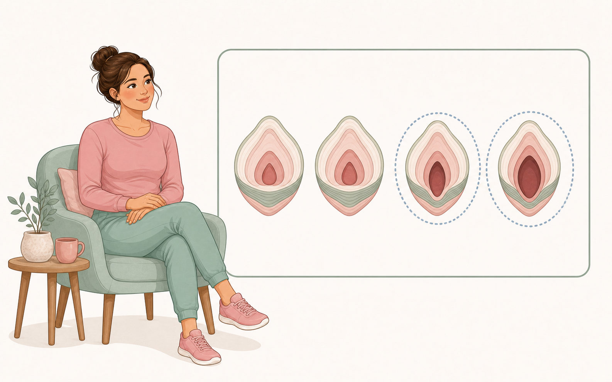

## IL-05a — 단계적 근력 운동

권장 대체 텍스트: 누운 교차 팔다리 동작, 밴드 당기기, 낮은 스텝업, 의자 스쿼트, 의자 지지 스플릿 스쿼트로 이어지는 다섯 단계 운동 그림.

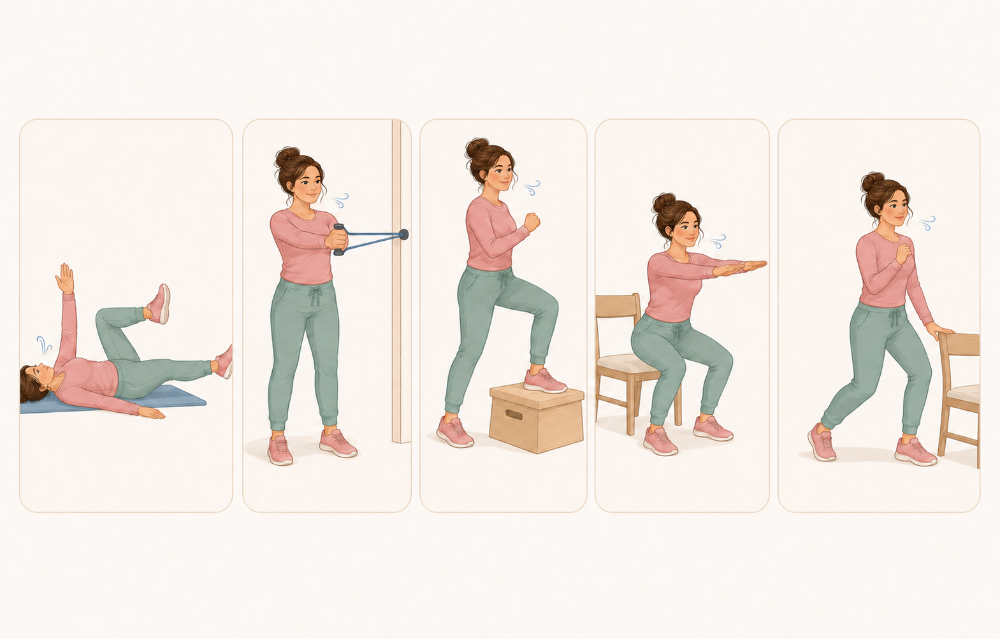

## IL-06a — 달리기 복귀

권장 대체 텍스트: 걷기에서 빠른 걷기와 짧은 조깅으로 서서히 진행하며 몸의 증상을 확인하는 젊은 산후 여성의 단계별 그림.

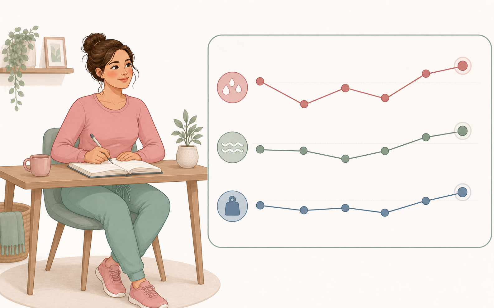
